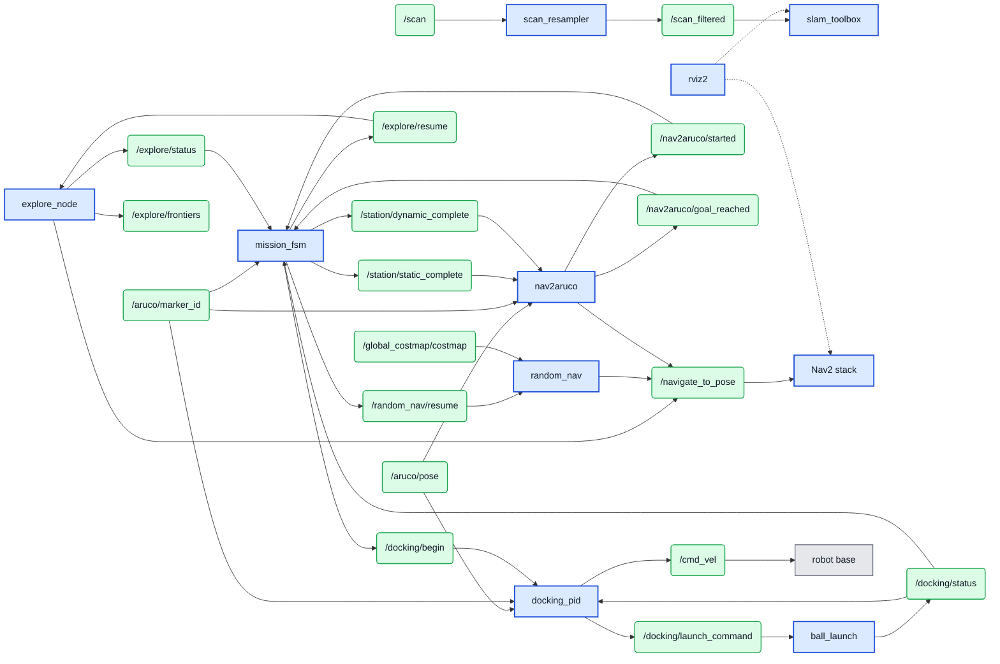
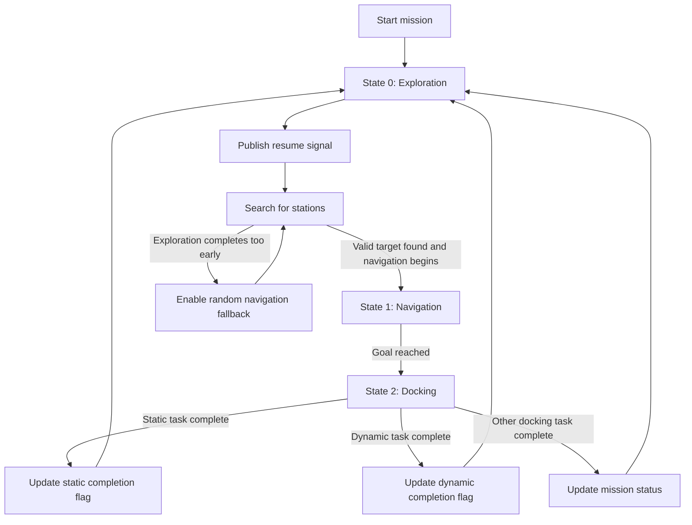
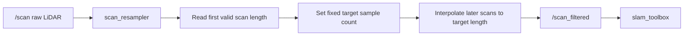
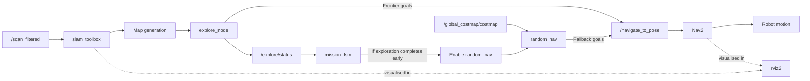
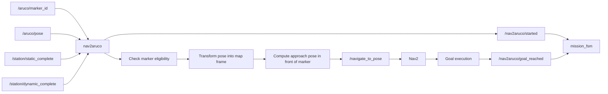

# **CDE2310 Systems Design Document**
# Group 6

**Members**

| Name | Matriculation Number |
|---|---|
| Kang Kiat Yang | A0322642M |
| Guda Omkar | A0309670B |
| Grover Amitaansh | A0335735Y |
| Bhatia Aksh | A0333106U |

---

## Requirement Specifications

### Problem Statement

The system must autonomously explore an unknown indoor maze arena, detect ArUco fiducial markers identifying delivery stations, navigate toward them, dock precisely, and deliver exactly three ping-pong balls per station — all without manual teleoperation after mission start. Two mandatory delivery stations must be completed: Station A (static receptacle) and Station B (dynamic/moving receptacle). Two optional stations exist: Station C (lift/elevator traversal to reach a second level) and Station D (static receptacle on the second level). The complete mission must be executed within a 25-minute window on a TurtleBot3 Burger platform running ROS 2. The system must also provide a user manual and operator interface for SSH-based activation.

---

### Stakeholder Needs

The system must demonstrate full autonomous operation within a constrained and unknown environment. Specifically, it must navigate a maze without any prior map, detect and interpret visual markers placed by the operator on delivery stations, transport and deliver ping-pong balls using a flywheel-based launcher mechanism, and optionally communicate with an external REST API to activate a lift for multi-level delivery. The operator prefers a single-command launch interface and a clear user manual for setup and operation with minimal technical expertise beyond SSH access.

---

### Functional Requirements

**Navigation and Mapping**

FR-01 — The system shall autonomously construct a 2D occupancy grid of the arena using LiDAR-based SLAM (SLAM Toolbox) without any prior map data.

FR-02 — The system shall implement frontier-based autonomous exploration to discover and navigate to unexplored regions of the map, sending frontier waypoints to Nav2 via the `NavigateToPose` action interface.

FR-03 — The system shall plan collision-free paths using Nav2's A* global planner on the inflated costmap and track them using the Dynamic Window Approach (DWA) local planner.

FR-04 — The raw LiDAR scan stream shall be normalised by a `scan_resampler` preprocessing node that interpolates all incoming scans to a fixed reference length before publishing to SLAM Toolbox, ensuring consistent map quality.

FR-05 — The system shall implement a `random_nav` fallback node that samples traversable goals from the global costmap and continues navigation via Nav2 when frontier-based exploration terminates prematurely before all mission stations have been found.

**Marker Detection**

FR-06 — The system shall detect ArUco markers (dictionary DICT_4X4_50) from the Raspberry Pi Camera Module V2 feed and estimate their 6-DOF pose using the `aruco_opencv` package (or equivalent OpenCV-based detector).

FR-07 — The system shall publish detected marker ID on `/aruco/marker_id` and marker pose on `/aruco/pose` for consumption by the navigation and docking subsystems.

FR-08 — Markers shall be sized 100–150 mm and printed with a matte finish to reduce glare. They must be detectable at a range of 2–3 metres under variable indoor lighting.

FR-09 — Camera calibration shall be performed using the `camera_calibration` package to ensure accurate pose estimation. A fallback pinhole model shall be used if valid intrinsics are unavailable.

FR-10 — For Station B's moving target, the vision node shall implement dynamic tracking using a Kalman filter or linear extrapolation to predict target position and time launches accordingly.

**Mission State Machine**

FR-11 — The system shall implement a `mission_fsm` node as the central supervisory controller, coordinating state transitions between exploration, navigation, and docking phases.

FR-12 — The FSM shall place the robot in an exploration state on startup by publishing a resume signal to the exploration subsystem via `/explore/resume`.

FR-13 — The FSM shall transition from exploration to navigation when the `nav2aruco` node identifies a valid, unvisited target and publishes on `/nav2aruco/started`.

FR-14 — The FSM shall transition from navigation to docking after `/nav2aruco/goal_reached` is published, and shall update the appropriate completion flags (`/station/static_complete` or `/station/dynamic_complete`) after docking succeeds.

FR-15 — The FSM shall return the system to exploration after each docking event completes, so that the next unvisited station can be located.

FR-16 — The FSM shall monitor exploration status and activate `random_nav` when `/explore/status` indicates that frontier exploration has ended before all required stations have been visited.

**Approach and Docking (nav2aruco)**

FR-17 — The `nav2aruco` node shall subscribe to `/aruco/marker_id` and `/aruco/pose` and, upon receiving a valid and unvisited marker, transform the marker pose into the map frame and compute an approach goal offset in front of the marker.

FR-18 — The `nav2aruco` node shall send the computed approach goal to Nav2 via the `NavigateToPose` action client and publish status on `/nav2aruco/started` and `/nav2aruco/goal_reached`.

FR-19 — The `nav2aruco` node shall check station completion flags before accepting a marker, suppressing repeated targeting of already-completed stations.

**Fine Docking and Alignment**

FR-20 — The `docking_pid` node shall perform visual servoing using live ArUco marker pose from `/aruco/pose` and `/aruco/marker_id` to execute fine-grained alignment and controlled approach to the docking station.

FR-21 — The docking controller shall implement dual independent PID control loops: one for distance control (forward/backward motion) and one for angular control (left/right turning) to achieve precise station alignment.

FR-22 — The docking controller shall implement asymmetric motor gain compensation (right gain: 1.8×, left gain: 1.5×) to account for hardware-specific differences in motor responsiveness.

FR-23 — The docking controller shall apply smooth motion optimization including:
- Velocity rate limiting (max accel: 0.3 m/s² linear, 1.0 rad/s² angular)
- Error dead zones (0.8cm lateral, 2cm distance) to prevent micro-corrections
- Derivative damping (Kd = 0.3 angular, 0.1 distance)

FR-24 — The docking controller shall implement a confirmation delay mechanism requiring the robot to hold the docked position within tolerance (±3cm distance, ±2cm lateral) for at least 1 second before declaring docking complete.

FR-25 — Upon successful docking confirmation, the docking controller shall publish the appropriate launch command ("static" or "dynamic") on `/docking/launch_command` based on the detected marker ID (0 = static, 1 = dynamic).

FR-26 — The docking controller shall maintain a completed markers set to prevent re-docking to already-serviced stations.

**Payload Delivery**

FR-27 — The launcher node shall subscribe to `/docking/launch_command` and execute the appropriate launch sequence based on the command received ("static" or "dynamic").

FR-28 — The launcher mechanism shall use a flywheel driven by an R380 DC motor controlled via L298N H-bridge (GPIO 23/24) and a servo-actuated gate (MG90S on GPIO 18, 50Hz PWM).

FR-29 — For static delivery (command "static"), the launcher shall execute: Ball 1 → 3.5s delay → Ball 2 → 5.5s delay → Ball 3, with 0.5s motor spin-up and 1.0s cooldown.

FR-30 — For dynamic delivery (command "dynamic"), the launcher shall wait for Marker 2 detection and synchronize ball release using a 1-second cooldown mechanism to prevent double-triggering.

FR-31 — The launcher node shall implement a multi-threaded executor with mutually exclusive callback groups for marker detection and launch command handling to prevent callback interference.

FR-32 — Upon launch sequence completion, the launcher shall publish "static docking is done" or "dynamic docking is done" on `/docking/status`, which the docking controller monitors to update its completed markers set.

FR-33 — The launcher shall implement launch-complete flags (`static_launch_done`, `dynamic_launch_done`) that persist throughout the mission to prevent repeat launches at the same station.


---

### Non-Functional Requirements

NFR-01 — The full mission stack shall be launchable from a single launch file that initialises all nodes in a staged sequence (preprocessing and mission nodes first, then mapping, navigation, and exploration components).

NFR-02 — All inter-subsystem communication shall use standard ROS 2 topics with documented message types and QoS profiles, enabling independent subsystem development and replacement.

NFR-03 — All tunable parameters (launch timing, detection thresholds, GPIO pin assignments) shall be exposed as ROS 2 parameters configurable at launch time with no hardcoded values in business logic.

NFR-04 — The system shall log all key state transitions and sensor readings via `/rosout` at the INFO level to support post-run debugging.

---

### Constraints

CON-01 — The robot platform is a TurtleBot3 Burger, with an additional RPi 3.0 provided. No modifications to the core drivetrain, OpenCR controller, onboard battery and RPi microcontroller are permitted.

CON-02 — The software stack shall target ROS 2 on Ubuntu, using SLAM Toolbox and Nav2 as the mapping and navigation backend.

CON-03 — The LiDAR's 360° field of view must not be obstructed by any mechanical or storage component. The third platform layer has been raised by 60 mm and the LiDAR by 35 mm to clear the ball cache tube.

CON-04 — The robot shall operate fully autonomously from the moment the mission clock starts. No teleoperation is permitted during the mission.

CON-05 — The total mission duration, including setup and cleanup, must be completed within the allotted session window of 20 minutes.

CON-06 — The flywheel DC motor must connect directly to the battery terminals via an L298N motor driver, bypassing the OpenCR regulators.

CON-07 — ArUco markers placed on delivery stations must be chosen and sized for reliable detection at 2–3 metres under varying indoor lighting conditions.

---

### Performance Requirements

PR-01 — The robot shall align with delivery receptacles with sufficient lateral accuracy for the flywheel launcher to deposit balls reliably into the receptacle.

PR-02 — The flywheel shall reach operational RPM quickly enough to ensure consistent launch velocity across all three shots per station.

PR-03 — The exploration algorithm shall achieve sufficient arena coverage before declaring the map complete, ensuring all stations are discoverable.

PR-04 — The ArUco marker detection pipeline shall process camera frames in real time and publish pose data with low latency from frame capture to support timely docking.

PR-05 — Peak simultaneous current draw across all subsystems shall remain below 6.5 A, safely within the battery's 9 A maximum continuous discharge limit (~28% safety margin).

---

### Power Budget Summary

#### Battery

| Parameter | Value |
|-----------|-------|
| Nominal Voltage | 11.1 V |
| Capacity | 1.8 Ah |
| C-Rate | 5C → Max safe current: **9 A** |
| Efficiency (real-world) | 80% |

```
Total Energy = 11.1 V × 1.8 Ah × 0.8 = 15.984 Wh = 57,542.4 J
```

---

#### Power Budget Table (Worst Case)

| Component | Rail | Voltage (V) | Current (A) | Power (W) |
|-----------|------|-------------|-------------|-----------|
| R380 5V DC Motor | 12 V battery | 11.1 | 0.5 | 5.55 |
| MG90S Servo Motor | Buck 5 V | 5 | 0.25 (stall) | 1.25 |
| L298N Motor Driver | Buck 5 V | 5 | 0.036 | 0.18 |
| Turtlebot Base | 12 V battery | 11.1 | — | 8.3 |
| RPi Camera Module 4 | RPi 3.3 V | 3.3 | — | negligible |
| **TOTAL** | | | | **15.28 W** |

---

#### Operation Time

```
Runtime = 57,542.4 J / 15.28 W = 3,765 s ≈ 62.7 minutes
```

| Parameter | Value |
|-----------|-------|
| Single mission duration | ~25 min |
| Estimated runtime | ~62.7 min |
| Missions possible | **~2.5 missions** ✅ |

---

#### Rail Safety Check

| Rail | Worst-Case Draw | Rated Limit | Status |
|------|----------------|-------------|--------|
| Battery (11.1 V) | 1.38 A (15.28 W / 11.1 V) | 9 A | ✅ |
| Buck Converter (5 V) | 0.286 A (1.43 W / 5 V) | 6 A | ✅ |
| RPi 3.3 V | Negligible | 500 mA | ✅ |

All rails operate well within their rated limits under worst-case conditions.

---

### Interface Requirements

IR-01 — The operator shall activate the robot through a terminal on their laptop via SSH. An operator interface must be developed for this purpose and documented in the user manual.

IR-02 — The user manual shall include instructions on where and how to apply ArUco markers to delivery stations, as well as pre-mission setup steps (ball loading, power-on, SSH connection, and launch command).

---

### Safety Requirements

SR-01 — The flywheel motor shall remain powered off until a launch command is actively issued by the docking controller, preventing unintended actuation during navigation.

SR-02 — The motor driver should connect directly to the battery to isolate the high-current flywheel circuit from the Raspberry Pi or OpenCR power bus, preventing brownouts during motor spin-up.

SR-03 — The system shall handle Ctrl+C gracefully; all nodes shall execute their shutdown procedures, stopping motor output and de-energising actuators.

SR-04 — Physical intervention by the operator (stopping the robot) is permitted if the robot is observed to be causing damage to the arena or to itself.

---

### Acceptance Criteria

| ID | Criterion | Pass Condition |
|---|---|---|
| AC-01 | Single-command launch | Full stack starts without errors from one launch file |
| AC-02 | Map construction | A populated occupancy grid is visible within 60 s of launch |
| AC-03 | Frontier exploration | Robot systematically explores the arena; `random_nav` activates if exploration ends early |
| AC-04 | Marker detection | Valid ArUco marker ID and pose published when marker is in camera range |
| AC-05 | Station suppression | Already-completed stations are not re-targeted by `nav2aruco` |
| AC-06 | Docking approach | Robot stops at an approach offset in front of the marker, not on top of it |
| AC-07 | Static delivery | 3 balls delivered into Station A (static) without launcher faulting |
| AC-08 | Dynamic delivery | At least 2 of 3 balls delivered into Station B (dynamic/moving) |
| AC-09 | Fault recovery | FSM returns to exploration within 5 s if docking or navigation fails |
| AC-10 | Mission completion | Robot completes Stations A and B within the 25-minute mission window |

---

## Concept of Operations (Con-Ops)

### Mission Context

Group 6's robot is an autonomous mobile robot (AMR) built on a TurtleBot3 Burger platform, augmented with a custom flywheel-based payload launcher, a spiral ball cache, and a Raspberry Pi Camera Module V2. Its mission is to autonomously explore an unknown indoor maze-style arena, detect ArUco fiducial markers placed on delivery stations, navigate toward and dock at each station, and deliver three ping-pong balls per station using the launcher mechanism. The entire mission must be completed within a 20-minute execution window.

There are four delivery zones, of which two are mandatory:

- **Station A (Static)** — a fixed delivery target in the maze zone, mandatory.
- **Station B (Dynamic)** — a moving delivery target in the maze zone, mandatory.
- **Station C (Lift/Elevator)** — an optional station requiring the robot to call an external elevator API and ride the lift to the second level.
- **Station D (Static, Level 2)** — an optional static delivery target on the second floor, accessible only after Station C.

Stations A and B can be completed in any order. The mission ends when both mandatory stations have been serviced, or when the mission timer expires.

---

### System Overview

The robot integrates the following subsystems:

| Subsystem | Role |
|---|---|
| Navigation and SLAM | LiDAR-based online mapping (SLAM Toolbox) and Nav2-based path planning and execution |
| LiDAR Preprocessing | `scan_resampler` node normalises incoming scan lengths for stable SLAM input |
| Frontier Exploration | `explore_node` performs frontier-based exploration; `random_nav` provides a fallback |
| Mission FSM | `mission_fsm` coordinates top-level state transitions across all subsystems |
| ArUco Detection | Camera-based marker detection and 6-DOF pose estimation for station identification |
| Nav2Aruco | `nav2aruco` translates detected marker poses into Nav2 approach goals |
| Docking PID | `docking_pid` provides visual servoing with dual PID loops (distance + angular), asymmetric motor compensation, and 1s confirmation delay. Publishes launch commands to `ball_launch` node. |
| Payload Launcher | `ball_launch` executes static/dynamic launch sequences, publishes completion status back to docking controller. |
| Electrical Architecture | LiPo battery powering all subsystems; BLDC connected directly to battery via ESC |

All subsystems communicate over ROS 2 topics. The `mission_fsm` node acts as the central arbiter, consuming status signals from all subsystems and issuing state transitions accordingly.

---

### Mission Phases

The mission is broken into four phases:

**Phase 0: Setup** — The operator places the robot at the start line, pastes ArUco markers onto the delivery stations as instructed in the user manual, refills the ball cache with 9 ping-pong balls, and powers on the robot via the OpenCR switch. The operator then SSH-es into the TurtleBot and executes the mission launch command from their laptop.

**Phase 1: Start Zone** — The robot leaves the start zone autonomously upon activation. Clearing the start line is treated as a meaningful milestone — it satisfies the minimum pass condition for the module as per the CDE2310 Github rules.

**Phase 2: Maze Zone** — The robot autonomously navigates through the maze, constructs an online map via SLAM Toolbox, and searches for ArUco markers identifying Stations A and B. It completes deliveries at each station. Optionally, it also locates Station C (lift lobby) and Station D (second-level static station) for bonus scoring.

**Phase 3: Cleanup** — The operator removes the robot and all ArUco markers from the arena after the mission is declared complete.

---

### Normal Operating Scenario

1. The operator places the robot at the designated start position, loads 9 ping-pong balls into the spiral cache, confirms all hardware is powered and functioning, and SSH-es into the robot.
2. Simultaneously, helpers should paste the ArUco markers on the docking stations. Markers 0, 1, 3 correspond to the static, dynamic, lift stations respectively. Marker 2 is pasted directly on the dynamic station's moving receptacle for the launch triggering.
3. On the RPI: Operator executes the single top-level launch command. The launch file initalise the robot's firmware (ROS bringup), camera firmware, as well as 2 nodes: aruco detection and ball launching
4. On the local terminal: Operator executes the single top-level launch command. The launch file initialises the scan resampler and mission FSM first, then starts SLAM Toolbox, Nav2, the exploration node, and RViz in a staged sequence.
5. The robot now starts to complete the mission autonomously.
6. Once all mandatory stations are complete and the map is fully explored, the mission ends.

---

### Startup Sequence

1. Power on the TurtleBot3 via the OpenCR switch. Confirm the LiDAR, camera, and motors are active.

2. From the operator laptop, SSH into the robot:
   ```
   insert ssh command here
   ```
3. Source the ROS 2 workspace and execute the top-level launch command:
   ```
   insert command here
   ```
   
4. Place the robot at the start position and confirm no obstacles are within the LiDAR's minimum detection range.

5. The robot will begin exploring the arena autonomously once all nodes are healthy.

---

### Exploration Phase

The `explore_node` implements frontier-based exploration. The SLAM Toolbox occupancy grid is analysed continuously to identify frontier cells — the boundary between known free space and unknown space. Frontier groups are selected as navigation targets and sent to Nav2 via the `NavigateToPose` action client. The robot explores systematically without requiring pre-defined waypoints.

If frontier exploration terminates before all required stations have been found (because the current map appears fully explored even though stations remain unvisited), the FSM detects this via `/explore/status` and activates `random_nav`. This fallback node samples valid, traversable goal positions from the global costmap and continues sending them to Nav2, maintaining search behaviour through the same navigation interface.

The LiDAR scan preprocessor (`scan_resampler`) runs as a compatibility layer throughout this phase. It normalises the variable-length raw scan messages from the LDS-02 to a fixed reference length by interpolation before passing them to SLAM Toolbox, ensuring stable and consistent map construction.

---

### Marker Detection and Navigation Phase

The camera-based ArUco detection pipeline runs continuously throughout the mission. When a marker is detected, `nav2aruco` checks whether the marker corresponds to an unvisited station. If the station has already been completed (indicated by `/station/static_complete` or `/station/dynamic_complete`), the detection is suppressed and the robot continues exploring.

For a valid new detection, `nav2aruco` transforms the marker pose from the camera frame into the map frame and computes a goal position slightly in front of the marker — not at the marker itself — to ensure the robot stops at a practical docking offset. This goal is sent to Nav2 as a `NavigateToPose` action. The node simultaneously publishes `/nav2aruco/started` to inform the FSM, which transitions the system into the Navigation state.

Camera calibration using the `camera_calibration` package ensures accurate 6-DOF pose estimation. The system uses the DICT_4X4_50  ArUco dictionary with marker sizes of 100–150 mm for reliable detection at 2–3 metres.

---

### Docking Phase

Once Nav2 reports the approach goal as reached, `/nav2aruco/goal_reached` is published and the FSM transitions to the Docking state. The `docking_pid` node takes over velocity control from Nav2, using the live marker pose from `/aruco/pose` and `/aruco/marker_id` to perform fine-grained visual servoing.

`docking_pid` node takes over from Nav2 using dual PID loops:
- **Distance loop:** Targets 25cm (±3cm tolerance)
- **Angular loop:** Targets -6cm lateral offset to align launcher with marker (±2cm tolerance)

The controller implements asymmetric motor gains (1.8× right, 1.5× left) to compensate for hardware differences, and requires the robot to hold position for 1 second before confirming docking.

Upon confirmation, `docking_pid` publishes the launch command ("static" for Marker 0, "dynamic" for Marker 1) and waits for `/docking/status` completion message before updating its completed markers set.


---


### Payload Delivery Phase
The `ball_launch` node subscribes to `/docking/launch_command` and `/aruco/marker_id` to control an R380 flywheel motor (GPIO 23/24) and MG90S servo gate (GPIO 18) using a multi-threaded executor.

**Static sequence (Marker 0):** When `ball_launch` receives "static" on `/docking/launch_command`- Launches 3 balls with timed delays (Ball 1 → 4s → Ball 2 → 6s → Ball 3). Total time: ~11 seconds.

**Dynamic sequence (Marker 1):** When `ball_launch` receives "dynamic" on `/docking/launch_command`- Waits for Marker 2 detection on moving target, launches balls synchronized with marker appearance using 1s cooldown to prevent double-triggering. 

Upon completion, `ball_launch` publishes "static docking is done" or "dynamic docking is done" on `/docking/status`. Launch completion flags persist throughout the mission to prevent re-launches.
### Fault and Recovery Scenarios

| Fault | Symptom | System Response |
|---|---|---|
| Marker lost during navigation | `nav2aruco` receives no valid pose update | Nav2 goal is cancelled; FSM returns to Exploration |
| Exploration ends too early | `/explore/status` signals completion before all stations found | FSM activates `random_nav` fallback; search continues |
| Docking PID cannot converge | Timeout or repeated failure on `/docking/status` | FSM aborts docking and returns to Exploration |
| SLAM map not ready | `/map` not yet available at startup | Nodes wait; navigation holds until map, odometry, and scan topics are all active |
| Launcher jam or mis-feed | IR break-beam detects no ball despite gate actuation | Launch sequence pauses; logged via `/rosout` |
| Lift API unavailable | External API call fails or times out | Optional Stations C and D are skipped; mandatory mission continues |
| Duplicate launch command | Station already serviced | `ball_launch` ignores, logs warning |

---

### Post-Mission Shutdown Sequence

1. Allow the mission to reach its natural end state, or interrupt with Ctrl+C to stop all nodes.
2. Confirm the robot has stopped moving (`/cmd_vel` publishes zero-velocity).
3. Power down the TurtleBot3 motors and Raspberry Pi safely via the OpenCR switch.
4. Remove any remaining ping-pong balls from the cache before storing the robot.
5. Remove all ArUco markers from the delivery stations and clean up the arena (Phase 3).
6. Kill any stale ROS 2 daemon processes before the next run:
   ```
   ros2 daemon stop
   ```

---

### Operator Responsibilities

The operator must inspect and confirm all 9 ping-pong balls are correctly loaded into the spiral cache before launch. They must place ArUco markers on the correct positions of each delivery station exactly as specified in the user manual, since incorrect marker placement will cause the robot to miss or mistarget stations. The operator must not physically intervene or move the robot once the mission has started, as any interference will corrupt the SLAM map and may cause the robot to lose localisation. The operator should monitor the RViz display and node logs for warnings during the early exploration phase, and may physically stop the robot only if it is observed to be causing damage to the arena or to itself.

---

## High Level Design

### Software Architecture

#### Mission FSM (`mission_fsm`)
- Central supervisory controller coordinating all subsystems
- Manages three states: **Exploration → Navigation → Docking**, looping until all stations complete
- Activates `random_nav` fallback if frontier exploration ends prematurely
- Updates station completion flags to prevent re-targeting already-serviced stations

#### Navigation, Mapping & Exploration
- **SLAM Toolbox** builds a live 2D occupancy grid from LiDAR — no prior map required
- **Nav2** handles global path planning (A*) and local trajectory execution (DWA)
- **`scan_resampler`** normalises variable-length raw LiDAR scans to a fixed reference length for SLAM stability
- **`explore_node`** performs frontier-based exploration; **`random_nav`** samples traversable costmap goals as fallback

#### Docking & Delivery
- **`nav2aruco`** converts detected ArUco marker poses into Nav2 approach goals, computed offset in front of — not on — the marker
- **`docking_pid`** performs visual servoing via dual PID loops once Nav2 brings the robot within range:
  - Distance loop (Kp=0.8, Kd=0.1): targets 25 cm standoff
  - Angular loop (Kp=2.0, Kd=0.3): targets −6 cm lateral offset to align launcher with marker
  - Asymmetric motor gain compensation (right 1.8×, left 1.5×) corrects hardware asymmetry
  - Holds within tolerance (±3 cm / ±2 cm) for 1 s before confirming dock
- **`ball_launch`** executes delivery: timed sequence for static (Ball 1 → 3.5 s → Ball 2 → 5.5 s → Ball 3), or marker-synchronised release at 100 Hz for dynamic target

---

### Hardware Architecture

#### Mechanical
- Stock TurtleBot3 Burger drivetrain retained; third platform layer raised **60 mm** and LiDAR raised **35 mm** to clear the ball cache tube
- Custom **flywheel launcher**: R380 DC motor driven via L298N H-bridge (GPIO 23/24)
- **Servo-actuated ball gate**: MG90S servo on GPIO 18, 50 Hz PWM
- Spiral ball cache stores **9 ping-pong balls** (3 per station × 3 stations)


#### Electrical
- Power source: **11.1 V, 1.8 Ah LiPo** (5C max, 9 A safe discharge limit)
- Payload motors powered via a dedicated **DC-DC buck converter (11.1 V → 5 V, 6 A rated)**, electrically isolated from the RPi's own 5 V rail — prevents brownouts during motor spin-up
- Total worst-case power draw: **12.23 W**
- Estimated runtime: **~78.4 minutes** — approximately **3× the 25-minute mission window**
- All rails operate well within rated limits; peak battery draw ~1.10 A vs. 9 A limit

---

### Key Design Decisions

| Decision | Rationale |
|---|---|
| Two-stage approach (Nav2 → PID) | Nav2 handles obstacle avoidance en route; PID handles precise final alignment. Direct PID-only tracking caused the robot to head straight into obstacles. |
| `scan_resampler` preprocessing | Raw LiDAR scan lengths were inconsistent; SLAM Toolbox required a stable fixed-length input for reliable mapping. |
| `random_nav` fallback | Frontier exploration could declare completion before all stations were found; random goal sampling extends search coverage. |
| Isolated payload power rail | Motor inrush from R380 sharing the RPi rail caused brownouts; buck converter isolation eliminates this failure mode. |
| −6 cm lateral docking offset | Launcher is mounted 6 cm left of the camera optical centre; offset compensates so the launcher — not the camera — aligns with the target. |
| 1-second docking confirmation delay | Prevents false docking confirmation from momentary alignment during approach oscillation. |

---

## Sub System Design

### Software

The software architecture was structured into four main functional subsystems: mission coordination, LiDAR preprocessing, autonomous navigation and exploration, and ArUco-guided station approach. Together, these subsystems enabled the TurtleBot3 to autonomously explore an unknown environment, detect mission-relevant stations, navigate toward identified targets, and execute docking-related actions in a controlled sequence. At system startup, the launch file initialises the custom preprocessing and mission nodes, then starts the mapping, navigation, exploration, and visualisation components in a staged manner so that the lower-level services are available before the higher-level behaviours begin.

<details>
<summary>ROS2 node/topic diagram</summary>


    
</details>

### FSM Mission Flow

The `mission_fsm` node functions as the supervisory controller of the mission. Its role is to coordinate the high-level progression of the robot between exploration, target approach, and docking. Rather than allowing all nodes to act independently, the finite state machine ensures that each behaviour is activated only when the required preconditions have been met. This reduces command conflicts and creates a predictable mission sequence.

At the start of the mission, the FSM places the robot in an exploration state by publishing a resume signal to the exploration subsystem. During this phase, the robot searches the environment for mission-relevant stations. The FSM continuously monitors marker detections, exploration status, navigation progress, and docking status. When the `nav2aruco` node identifies a valid target and reports that guided navigation has started, the FSM transitions from exploration to a navigation state. Once the goal has been reached, the FSM then enters the docking phase. After docking has been completed successfully, the FSM updates the appropriate completion flags and returns the system to exploration so that the next target can be found.

This structure was important because the mission required multiple objectives to be completed in sequence. The FSM therefore acted as the central decision-making layer that regulated when the robot should continue searching, when it should commit to an identified station, and when it should finalise the approach with docking-related behaviour.


### ArUco Calibration

Accurate 6-DOF pose estimation requires precise camera intrinsic parameters. The system uses a ChArUco calibration board (7×5 squares, 57mm square length, 43mm marker length, DICT_4X4_50 dictionary) to calibrate the Raspberry Pi Camera Module V2.

The `charuco_calibration` node subscribes to `/camera/image_raw` and detects the ChArUco board in real-time. The operator captures 10-20 images of the board from different angles and distances by pressing the spacebar when sufficient corners are detected. Once enough samples are collected, the node performs calibration using OpenCV's `calibrateCameraCharuco` function and saves the results to `camera_calibration.yaml`.

**Calibration Error:** RMS reprojection error of 0.299 pixels indicates good calibration quality for visual servoing applications.

These parameters are loaded by the `aruco_node` at startup and used for marker pose estimation throughout the mission. The relatively low distortion coefficients (k1, k2) indicate minimal barrel/pincushion distortion, while the tangential distortion (p1, p2) is negligible, confirming the camera module's optical quality is suitable for precision docking operations.

### LiDAR Filter

The `scan_resampler` node serves as a preprocessing layer between the LiDAR sensor and the mapping subsystem. It subscribes to the raw `/scan` topic and republishes a processed scan on `/scan_filtered`. This node was necessary because the raw LiDAR data did not always contain the same number of scan samples in every message. In contrast, `slam_toolbox` performs mapping more reliably when the scan structure remains consistent across time.

To address this mismatch, the `scan_resampler` node stores the length of the first valid scan message as a reference and uses it as the fixed target length for all subsequent scans. Each later LiDAR message is then interpolated so that its number of readings matches this reference size before being republished. In this sense, the node normalises the incoming scan stream. Without this step, the raw scan variability could introduce instability into downstream mapping and localisation.

This subsystem was therefore a compatibility layer that ensured the LiDAR output was in a form suitable for `slam_toolbox`. Its role may appear simple, but it was essential because the navigation and exploration pipeline depended on a stable map, and the quality of that map depended directly on the consistency of the scan input.



### Navigation Stack

The navigation subsystem combined `slam_toolbox`, Nav2, `explore_node`, `random_nav`, and RViz. Together, these components allowed the robot to map the environment online, explore unknown space, generate motion goals, and execute those goals safely. This subsystem formed the backbone of the robot’s autonomous mobility.

The first stage of this subsystem is `slam_toolbox`, which uses the filtered LiDAR stream from `/scan_filtered` to incrementally construct a map of the unknown environment. Once a map is available, `explore_node` performs frontier-based exploration. Frontier exploration works by identifying the boundary between known free space and unexplored space, then sending these frontiers as navigation goals to Nav2 through the `NavigateToPose` action interface. In this way, the robot can autonomously move through the environment without requiring manually pre-defined waypoints.

A key design consideration in this project was that frontier exploration may terminate before the entire mission has actually been completed. This can happen when the current map appears sufficiently explored, even though not all required stations have been detected. To improve robustness, a fallback node named `random_nav` was introduced. When the FSM determines that exploration has ended too early, `random_nav` takes over and samples traversable goals from the global costmap, continuing the search process through the same Nav2 interface. This provides a secondary search strategy when frontier-based exploration no longer produces useful goals.

RViz was included as a visualisation tool for debugging and validation. It allowed real-time observation of the generated map, the robot pose, and the overall navigation behaviour during testing. It was also needed as part of mission requirements to record the map generation.



### Nav2Aruco

The `nav2aruco` node forms the link between visual marker detection and the general-purpose navigation stack. Its role is to convert a detected ArUco marker into a valid navigation target that can be passed to Nav2. In the overall mission logic, this allows the robot to respond intelligently when a relevant station has been identified.

The node subscribes to the detected marker ID and marker pose. When a marker is received, it first checks whether the marker is relevant to the mission and whether the associated station has already been completed. This prevents the robot from repeatedly targeting the same station once the required action has already been performed. If the marker is accepted, the node transforms the marker pose into the map frame and computes a goal position slightly in front of the marker instead of directly on top of it. This is important because a practical docking or interaction manoeuvre requires the robot to stop at a usable offset pose rather than collide with the marker location itself.

After the target pose has been generated, `nav2aruco` sends the goal to Nav2 through the `NavigateToPose` action client. At the same time, it publishes status messages indicating when guided navigation has started and when the goal has been reached. These status messages are used by the FSM to coordinate the transition from exploration into docking. As a result, `nav2aruco` acts as the bridge between perception and action, translating raw marker detections into mission-aware navigation behaviour.



### ArUco Detection and Visual Servoing

The `aruco_docking_pid` node implements precision visual servoing for station alignment using dual independent PID control. It operates directly in the camera frame, using live marker pose data to execute fine-grained docking maneuvers after Nav2 has brought the robot within 1-2 meters of the target.

The controller implements two independent PID loops: a distance loop (Kp=0.8, Kd=0.1) controlling forward/backward motion via marker Z-coordinate, and an angular loop (Kp=2.0, Kd=0.3) controlling left/right turning via marker X-coordinate. The distance loop targets 25cm from the marker, while the angular loop targets a -6cm lateral offset to compensate for the launcher being mounted 6cm left of the camera optical center.

Hardware testing revealed asymmetric motor response between left and right turns. The controller compensates with different gains: right turns use 1.8× gain with 0.08 rad/s minimum velocity, while left turns use 1.5× gain with 0.06 rad/s minimum. This ensures symmetric control behavior despite hardware asymmetry.

To prevent jerky motion, the controller implements velocity rate limiting (0.3 m/s² linear, 1.0 rad/s² angular), error dead zones (0.8cm lateral, 2cm distance), and derivative damping. The controller requires the robot to hold position within tolerance (±2cm lateral, ±3cm distance) for 1 second before confirming docking, preventing false positives from momentary alignment.

Upon successful docking confirmation, the controller publishes the appropriate launch command ("static" for Marker 0, "dynamic" for Marker 1) on `/docking/launch_command` and maintains a completed markers set to prevent re-docking to already-serviced stations.

### Payload Delivery System

The `ball_launch` node controls payload delivery using an R380 flywheel motor (GPIO 23/24) and MG90S servo gate (GPIO 18). It runs as an independent process with a multi-threaded executor featuring two mutually exclusive callback groups: one for marker detection updates and one for launch command handling.

For static delivery (command "static"), the launcher executes a timed sequence: spin up flywheel (0.5s) → Ball 1 → 3.5s delay → Ball 2 → 5.5s delay → Ball 3 → 1.0s cooldown → stop flywheel. Total time is approximately 11 seconds.

For dynamic delivery (command "dynamic"), the launcher monitors Marker 2 (attached to the moving receptacle) at 100 Hz. When Marker 2 appears, a ball is launched. The system then waits for the marker to disappear and enforces a 1-second cooldown before accepting the next detection, preventing double-triggering. This sequence repeats for three balls. No timeout protection is implemented — the launcher will wait indefinitely for Marker 2.

Launch completion flags (`static_launch_done`, `dynamic_launch_done`) persist throughout the mission and are never reset, enforcing the constraint that each station can only be serviced once per mission run. Upon sequence completion, the launcher publishes "static docking is done" or "dynamic docking is done" on `/docking/status`, which the `aruco_docking_pid` node monitors to update its completed markers set.

### Electrical Subsystem

### Purpose

Capture the project's power distribution, wiring, and electrical integration strategy.

---

### Power Budget

- List the expected loads.
- Capture nominal voltage and current assumptions.
- Reserve margin for sensor and actuation peaks.

#### Battery Life

- **Voltage:** 11.1 V
- **Current Capacity:** 1.8 Ah
- **C-Rate:** 5C
- **Maximum safe current** = Capacity × C-Rate = 1.8 × 5 = **9 A**

Assuming 80% battery efficiency for real-world scenario:

```
Total Energy = Voltage × Current Capacity × Efficiency
             = 11.1 V × 1.8 Ah × 0.8
             = 15.984 Wh
             = 15.984 × 3600 J
Total Energy = 57,542.4 J
```

---

### Power Budget Table (Worst Case Scenario)

| Component | Voltage (V) | Current (A) | Max Power Consumption (W) |
|-----------|-------------|-------------|---------------------------|
| R380 5V DC Motor | 5 | 0.5 (operational) | 2.5 (operational) |
| MG90S Servo Motor | 5 | 0.25 (stall) | 1.25 (stall) |
| L298N Motor Driver | 5 | 0.036 (operational) | 0.18 (operational) |
| Turtlebot (During Movement) | 11.1 | — | 8.3 (surge) |
| RPi Camera Module 4 | 3.3 | — | — (powered via CSI from RPi) |

---

### Operation Time

```
Operation Time = 57,542.4 J / (2.5 + 1.25 + 0.18 + 8.3) W
              = 57,542.4 / 12.23 W
              = 4,703.4 s
              ≈ 78.4 minutes
```

#### Mission Duration Feasibility

- **Single mission duration:** ~25 minutes
- **Available runtime:** ~78.4 minutes
- 78.4 / 25 = **~3 full missions possible**

The TurtleBot3 battery provides enough power to complete the mission at least 3 times under real-world conditions, at 80% efficiency, under the worst-case scenario that every component draws maximum power simultaneously and continuously.

> **Note:** The PDR's original energy calculation did not apply the 80% efficiency factor. The figure above is the corrected worst-case estimate. The original Group 6 calculation (without efficiency derating) produced an estimated runtime of ~2 hr 24 min, which should be treated as a theoretical upper bound.

---

### Wiring and Connections

The robot-side wiring is divided into two subsystems: the **Turtlebot base** and the **custom payload system**.

**Turtlebot Base:**
- LiDAR → RPi via UART
- RPi Camera Module 4 → RPi via CSI-2 / I2C (15-pin FPC ribbon cable)
- RPi → OpenCR via DYNAMIXEL Protocol 2.0 (USB)
- OpenCR → Wheel Motors via TTL bus

**Custom Payload System:**
- LiPo Battery (11.1 V) → DC-DC Step-Down Buck Converter → 5 V regulated rail
- 5 V rail → L298N Motor Driver → R380 5V DC Motor (PWM speed control)
- 5 V rail → MG90S Servo Motor (gate mechanism)
- RPi GPIO (PWM) → L298N enable / direction input pins
- RPi GPIO (PWM) → MG90S servo signal line

**Signal-Level Notes:**
- The RPi outputs 3.3 V logic on its GPIO pins. The L298N input pins are 5 V tolerant and accept 3.3 V logic directly — no level shifting is required.
- The MG90S servo signal line is driven directly from RPi GPIO PWM at 3.3 V logic, which is within the servo's accepted input range.
- The buck converter output is electrically isolated from the RPi's own 5 V rail, preventing motor inrush current from causing a brownout on the RPi.

The full external connections schematic is captured in KiCad 9.0.5 (`cde2310.kicad_sch`, Sheet 1/1, titled *"Group 6 External System Schematic"*).

---

### Sensor and Actuator Integration

#### Camera Power and Data

The RPi Camera Module 4 connects to the Raspberry Pi via a 15-pin FPC ribbon cable using the CSI-2 interface, with I2C used for camera control. Power is supplied directly through the FPC connector from the RPi's onboard 3.3 V rail. No separate power rail is required.

#### Launcher and Gate Control Interfaces

The R380 DC motor (flywheel) is driven via the L298N H-bridge motor driver. The RPi sends PWM signals to the L298N's enable and direction input pins to control motor speed. The MG90S servo (ball gate mechanism) is driven by a dedicated RPi GPIO PWM output at 50 Hz (1–2 ms pulse width). The launcher control ROS2 node subscribes to the `/launcher/trigger` topic and translates trigger messages into the appropriate GPIO and PWM commands.

---

### Power Budget — Design Assumptions

*Worst Case Scenario | Electrical Subsystem*

#### A. Voltage Assumptions

| Parameter | Value / Assumption |
|-----------|-------------------|
| Battery Nominal Voltage | 11.1 V — treated as constant throughout discharge; voltage sag during depletion is not modelled. |
| R380 5V DC Motor | 5 V — supplied from the DC-DC step-down buck converter (11.1 V → 5 V, 6 A rated output). |
| MG90S Servo Motor | 5 V — supplied from the same 5 V buck converter rail. |
| L298N Motor Driver | 5 V logic and motor supply — both from the 5 V buck converter rail. |
| RPi Camera Module 4 | 3.3 V — powered via the CSI-2 FPC connector from the RPi's onboard 3.3 V regulator. No separate voltage rail assumed. |
| Turtlebot Subsystem | 11.1 V — the Dynamixel wheel motors, OpenCR board, RPi 4B, and LiDAR are all treated as a single subsystem powered directly from the battery. |

#### B. Current Assumptions

##### B.1 General

All components are assumed to draw their maximum or surge current simultaneously and continuously. No duty cycling, idle states, or staggered operation are modelled. This is the absolute upper bound on current draw.

##### B.2 Battery Rail (11.1 V)

| Parameter | Value / Assumption |
|-----------|-------------------|
| Rated Capacity | 1.8 Ah |
| Maximum C-Rate | 5C |
| Maximum Safe Current | 1.8 Ah × 5C = **9 A** |
| Worst Case Current Draw | **1.10 A** — derived by summing all component power values (12.23 W total) and dividing by 11.1 V. |
| Safety Margin | 1.10 A << 9 A. The battery is not at risk of overcurrent under any operating condition. |

##### B.3 Buck Converter 5 V Rail (Payload System)

This converter (11.1 V → 5 V, rated to 6 A) is the common 5 V source for the R380 motor, MG90S servo, and L298N motor driver. The worst-case load on this rail is:

| Parameter | Value / Assumption |
|-----------|-------------------|
| R380 5V DC Motor (operational) | 2.5 W |
| MG90S Servo Motor (stall) | 1.25 W |
| L298N Motor Driver (operational) | 0.18 W |
| **Total worst-case load** | **3.93 W → 0.786 A at 5 V** |
| Rail headroom | 0.786 A << 6 A rated output. The converter is not at risk of overcurrent. |

##### B.4 RPi Camera Module 4 (3.3 V Rail)

| Parameter | Value / Assumption |
|-----------|-------------------|
| Supplied by | RPi 4B onboard 3.3 V regulator via CSI-2 FPC connector. |
| Camera draw | Low — exact figure not datasheet-confirmed at PDR stage; treated as negligible for budget purposes. |
| Risk | None anticipated; CSI-2 power delivery is standard and within RPi rated limits. |

#### B.5 R380 Motor — Current Rationale

| Parameter | Value / Assumption |
|-----------|-------------------|
| R380 operational current | 0.5 A at 5 V — from datasheet. |
| Assumption | Motor is assumed to run at operational current continuously. Stall current is not modelled as the flywheel runs unloaded between shots and stall duration is negligible during normal operation. |
| Note | If stall does occur, the L298N's thermal protection will limit damage before the 6 A buck converter limit is reached. |

##### B.6 MG90S Servo — Stall Current Rationale

| Parameter | Value / Assumption |
|-----------|-------------------|
| MG90S stall current | 0.25 A at 5 V — from datasheet. |
| Assumption | Servo is assumed to stall continuously throughout operation. While physically unlikely during normal gate cycling, this provides a conservative upper bound consistent with the worst-case methodology. |

##### B.7 Turtlebot Subsystem Current

| Parameter | Value / Assumption |
|-----------|-------------------|
| Components included | Dynamixel wheel motors (×2), OpenCR board, Raspberry Pi 4B, LiDAR. |
| Power value | 8.3 W at 11.1 V (surge during movement). |
| Source | Turtlebot 3 published specification — not individually measured at PDR stage. |
| Note | These components are excluded as individual line items in the power budget table; their draw is fully captured in this single figure. |

---

### Safety Considerations

- Protect against overcurrent and incorrect polarity.
- Keep hardware actuation disabled unless explicitly requested.

#### 1. Overcurrent Protection

No dedicated hardware overcurrent protection is implemented in the custom payload circuitry. The DC-DC buck converter's rated 6 A output limit provides a passive ceiling on current delivered to the payload motors. The Turtlebot's OpenCR board provides onboard overcurrent and thermal protection for the base subsystem. These are considered sufficient, as the worst-case payload current draw of 0.786 A is well within the buck converter's 6 A limit, and the total battery draw of 1.10 A is well within the battery's maximum safe discharge current of 9 A.

#### 2. Reverse Polarity Protection

The Li-Po battery uses a physically keyed connector that prevents incorrect polarity connection. No additional circuit-level reverse polarity protection is implemented in the custom circuitry.

#### 3. RPi Brownout Prevention

The custom payload motors (R380 and MG90S) are powered exclusively from the DC-DC buck converter's 5 V rail, which is electrically isolated from the RPi's own 5 V supply. This design decision eliminates the risk of motor inrush current causing a brownout on the RPi — a known failure mode when motors share the RPi's power rail directly.

---

### Validation

#### 1. Runtime

At PDR stage, physical validation has not yet been conducted. All runtime estimates are theoretical. The worst-case power budget predicts a runtime of approximately 78.4 minutes under 80% battery efficiency, which exceeds the expected single mission duration of ~25 minutes by a factor of ~3. Physical runtime validation is scheduled as part of the integration testing phase.

#### 2. Voltage Stability

Voltage stability under load has not yet been empirically verified. The use of a dedicated DC-DC buck converter for the payload rail is expected to prevent brownouts on the RPi's 5 V supply. This will be confirmed during integration testing by monitoring the RPi's supply voltage under simultaneous motor and navigation load.

#### 3. Startup Actuation Behaviour

The launcher control ROS2 node is designed to keep the R380 motor off and the MG90S servo in the closed (resting) position until a valid `/launcher/trigger` message is received. The Turtlebot drive motors will produce no motion until all required ROS data streams (map, odometry, LiDAR scan) are available and a navigation goal is issued. Confirmation of this behaviour is pending hardware-in-the-loop testing.

#### 4. Motor Torque Under Load

A key outstanding validation item is whether the R380 motor delivers sufficient torque to consistently accelerate ping pong balls to the required exit velocity. Compression force between the flywheel hood and the ball cannot be accurately calculated without physical testing. If the R380 is found to be insufficient, a higher-torque or BLDC motor alternative will be evaluated, at the cost of increased electrical complexity.
### Mechanical Subsystem

The mechanical subsystem is responsible for storing, feeding, and launching ping pong balls at the designated delivery stations. It integrates four primary assemblies onto the TurtleBot3 Burger platform without permanently modifying the chassis.

### Flywheel Launcher Assembly

A ping pong ball is channelled through the feed tube and pinched between the spinning flywheel and a static compression hood. Friction between the ball surface and the flywheel accelerates the ball to the desired exit velocity. Exit velocity is proportional to flywheel RPM and is adjusted by varying the resistance in the flywheel motor circuit. The compression hood angle and gap are set mechanically and remain fixed during a mission. The gate mechanism ensures the ball has sufficient forward velocity to pass through compression and is not bounced back.

| Part | Specification / Material | Notes |
|---|---|---|
| Flywheel disc | PETG with insulation tape layer, ~35 mm diameter | High-friction surface ensures reliable ball grip |
| Compression hood | PETG 3D-printed, fixed geometry | Gap to flywheel ≈ 36–38 mm (tuned during testing) |
| DC Motor | R380, ≥ 3 000 RPM at 11.1 V | Mounted via 3D-printed bracket to waffle plate |
| Motor mount | PETG, 4 × M3 screws to L-mounts | ± 5 mm lateral adjustment for hood gap tuning and launch flexibility |

Assuming a flywheel surface speed of approximately 5.5 m/s (at ~3 000 RPM, 35 mm diameter) and a compression efficiency of ~60%, estimated ball exit speed is 2–3 m/s. At a 20° launch angle this yields a horizontal range of approximately 0.5–1 m, consistent with the station distances specified in the mission.

---

### Spiral Ball Cache (Hopper)

- The cache is a hollow PETG tube of inner diameter 43 mm (3 mm clearance around the 40 mm ball) that wraps around the robot's second-level perimeter in a spiral path inclined at 20° to horizontal. The spiral makes 3/4 turn around the robot, with a total tube length of approximately 500 mm, providing capacity for at least 9 balls in single file.
- Gravity acts as the primary feed force along the 20° incline.
- The tube's highest point must remain below the LiDAR's horizontal scan plane. To achieve this, the TurtleBot3's third layer spacer has been extended from the standard 45 mm to 60 mm, and the LiDAR sensor assembly has been raised an additional 35 mm via a printed riser platform. These modifications together provide 95 mm of vertical clearance for the cache tube and launcher body.
- The spiral tube is split into segments: three straights and two quarter-arc curved sections. Segments are joined by male/female joints locked with M3 screws. If any segment fails a print quality check, only that segment is reprinted.

---

### Servo-Actuated Feed Gate

The feed gate controls the precise moment a ball enters the flywheel compression zone. It prevents multiple balls from entering simultaneously (which would cause jamming), allows software-controlled firing sequences, and imparts initial velocity to the ball into the flywheel.

A standard MG90S servo (180° rotation) rotates a PETG gate paddle between two positions:

- **CLOSED** — paddle blocks the outlet port; ball rests against it.
- **OPEN** — paddle rotates 90°; ball rolls freely into the flywheel while the second half of the gate blocks the next ball.

The gate pivot axis is perpendicular to the ball travel direction and is press-fit directly onto the servo horn.

---

### Mounting Structure

- All mechanical components attach to the TurtleBot3 waffle plates using M3/M4 screws through the 15 mm pitch hole grid. PETG printed feet on each bracket span at least two grid holes to prevent rotation.
- The motor bracket is an O-shaped PETG part with 2 × M3 bosses on the front face and one M2 clamp screw around the motor body. Horizontal slots (3 mm travel) allow the motor position to be adjusted to set the compression gap during assembly.
- Multiple L-shaped brackets mount the cache tubes to the waffle plates. These brackets are slotted, allowing adjustment of mechanical parts if necessary. Each bolts directly to the Layer 2 or Layer 3 waffle plate. The tabs are designed to shear-fail before the tube itself breaks, protecting the cache geometry in a collision.
- A 35 mm tall, four-post PETG riser is interposed between the existing Layer 3 spacers and the LiDAR mounting plate. The riser posts align with the standard TurtleBot3 M2 column pattern and are hollow to route the LiDAR USB cable.

---
### Joints and tolerances
#### Flywheel ↔ Motor Shaft

| Attribute | Detail |
|---|---|
| Interface type | Mechanical — rotary press-fit |
| Motor shaft diameter | 2.3 mm |
| Max torque transfer | ≥ 0.05 N·m (well within flywheel structural margin) |
| Assembly procedure | Press flywheel hub directly onto shaft |

---

#### Flywheel Assembly ↔ Compression Hood

| Attribute | Detail |
|---|---|
| Interface type | Mechanical — fixed spatial gap |
| Nominal gap | 36 mm (ball diameter 40 mm minus ~4 mm compression) |
| Adjustment method | Horizontal slot on motor bracket (± 3 mm) |
| Tolerance | ± 0.5 mm (tighter gap → higher launch force; looser → ball slippage) |

---

#### Cache Tube ↔ Flywheel Inlet Port

| Attribute | Detail |
|---|---|
| Interface type | Mechanical — screw-fit tube junction |
| Outlet tube OD | 45 mm (slip-fits into 45.5 mm ID inlet port on launcher body) |
| Ball centre-line offset from flywheel centre | 8 mm — asymmetric due to space constraints |

---

### Feed Gate ↔ Cache Tube

| Attribute | Detail |
|---|---|
| Interface type | Mechanical — gate paddle pivoting in servo slot |
| Slot width in tube wall | 20 mm (same slot geometry across all tube sections for flywheel and servo) |
| Open-position stop | Servo software limit at 90° — do not over-rotate (ball would jam on paddle return) |

---

### Mounting Brackets ↔ TurtleBot3 Waffle Plate

| Attribute | Detail |
|---|---|
| Interface type | Mechanical — bolted joint |
| Fastener | M3 × 10/15 mm cross-head screws |
| Grid pitch | 15 mm (TurtleBot3 standard) |

---

### LiDAR Riser ↔ Layer 3 Spacers and LiDAR Plate

| Attribute | Detail |
|---|---|
| Interface type | Mechanical — standard TurtleBot3 posts, extended length |
| Riser height | 35 mm |

---
## Interface Control Documents

This section documents the interfaces through which the robot’s major subsystems and the operator interact during mission execution. These interfaces were implemented primarily through ROS 2 topics, action calls, and launch-level dependencies connecting the perception, mapping, navigation, mission control, docking, and payload delivery subsystems into a single coordinated workflow. Internally, scan_resampler interfaced with slam_toolbox by providing a normalised LiDAR stream, the exploration and target-approach nodes interfaced with Nav2 through shared navigation actions, and mission_fsm acted as the central supervisory layer by monitoring subsystem status topics and enabling the appropriate next behaviour. The docking and launcher subsystems further depended on explicit command and feedback topics to ensure that payload delivery occurred only after successful alignment and docking confirmation. Externally, the operator interfaced with the system through top-level launch files executed over SSH, which provided a simplified method of bringing up the required firmware and software nodes in the correct sequence. Taken together, these interfaces defined how information, control authority, and operational flow were managed across the complete mission system.

## Soft/Firmware Development Documentation

### 1. Establishing the Software Baseline

The software development process was carried out in a staged and iterative manner, with each phase building on the stability and performance of the previous one. The initial stage focused on establishing a reliable launch structure and configuration baseline. Early work addressed startup sequencing, particularly ensuring that the frontier exploration node was launched only after the required mapping and navigation components were available. At the same time, the configuration files for `slam_toolbox` and Nav2 were consolidated within the workspace, improving maintainability and reducing configuration inconsistency during integration.

**Relevant commits**
- `b79411e` — fix: Start frontier node last
- `44e711c` — update: Config files for `slam_toolbox` and Nav2 moved into workspace

### 2. Implementing Mission-Level Coordination

Following this, development shifted toward the implementation of mission-level coordination. A dedicated finite state machine was first introduced as a standalone package and node, and was subsequently expanded into the supervisory controller of the mission. This marked a significant step in the software design, as system behaviour was no longer governed solely by independent node execution, but by a central control layer that determined when the robot should explore, navigate toward a target, and execute docking-related actions. Later updates show this controller being progressively integrated with frontier exploration, marker-guided navigation, and fallback search behaviour.

**Relevant commits**
- `69c5939` — init: Mission FSM package and node
- `07785e4` — update: FSM template ready
- `b481bae` — update: Static docking with frontier works
- `4ba183f` — update: `nav2aruco` integrated into FSM
- `6df5122` — update: Mission FSM uses `random_nav` when frontier completes

### 3. Improving Navigation and Perception Reliability

In parallel, considerable effort was directed toward strengthening the reliability of navigation and perception. Nav2 parameters were refined through repeated tuning, including adjustments to the robot radius and alignment between the global and local costmap settings. A LiDAR filtering stage was also introduced to stabilise the scan data sent to the mapping subsystem, and was later corrected to resolve an off-by-one scan-count issue while recalculating `angle_increment` more consistently. These changes indicate that practical testing highlighted the importance of robust perception and motion-planning behaviour before higher-level mission logic could function consistently.

**Relevant commits**
- `4cef9bb` — fix: Increased robot radius in Nav2 parameters
- `75fe0ff` — fix: Increased robot radius by 2 cm
- `3559aba` — fix: Matched global costmap robot radius to local costmap
- `a10149f` — new feature/update: Working LiDAR filter `scan_resampler` and corrected `slam_toolbox` parameter-file launch
- `b4ab6db` — fix: LiDAR filter `scan_resampler` fix for off by exactly +1 LiDAR readings expected

### 4. Integrating Perception-Guided Navigation

Once the navigation foundation was sufficiently stable, development progressed toward perception-guided mission execution. Static docking was first made to work together with frontier exploration, after which ArUco-guided navigation was introduced as a dedicated capability. 

We realised we needed this feature aside from pure camera tracking and just PID docking during testing. When the Turtlebot3 saw a marker from afar, it would head straight for it regardless of obstacles in the way. Hence, we decided to utilise Nav2 for its ability to detect and navigate around obstacles automatically. 

This allowed the robot to safely navigate towards the station while accounting for obstacles, then transition into PID docking for the last fine adjustments for accurate aim.

**Relevant commits**
- `b481bae` — update: static docking with frontier works
- `968a534` — new feature: Nav2-to-ArUco marker node (`nav2aruco`) works
- `4ba183f` — update: `nav2aruco` integrated into FSM

### 5. Adding Fallback Search Behaviour

A further refinement was the introduction of fallback search behaviour to improve robustness in cases where frontier exploration terminated before all required stations had been found. The exploration behaviour was adjusted so that it no longer returned automatically to the initial position upon completion, and a separate `random_nav` node was then developed and incorporated into the overall control logic. This provided a secondary exploration strategy, allowing the robot to continue searching traversable space even when frontier-based methods no longer produced useful goals.

**Relevant commits**
- `10e3384` — update: Frontier exploration no longer returns to initial position when complete
- `54cdda1` — new feature: `random_nav` node works
- `6df5122` — update: Mission FSM updated to use `random_nav` when frontier completes
### 6. ArUco Detection and Visual Servoing

Camera calibration was performed using a ChArUco board to obtain precise intrinsic parameters for 6-DOF pose estimation. The `aruco_docking_pid` node was then developed with dual independent PID loops for distance and angular control, implementing asymmetric motor compensation to account for hardware differences in left versus right turning. Smooth motion optimization was added through velocity rate limiting, error dead zones, and derivative damping. A 1-second docking confirmation delay was implemented to prevent false positives from momentary alignment. The launcher offset compensation (-6cm lateral) ensures the physical launcher, rather than the camera, aligns with the marker for accurate ball delivery.

**Relevant commits:**
- `819ec4b` — Add ArUco calibration files
- `641c451` — Add camera, aruco docking and PID code

### 7. Final Integration and System Tuning

The final stage of development focused on full-system integration and final tuning. PID-based docking, together with static and dynamic launching behaviour, was incorporated into the overall workflow, and the docking node was added to the main launch configuration. Final adjustments were then made to the Nav2 parameters prior to the concluding system run. Overall, the documented development journey reflects a clear progression from baseline launch setup, to coordinated mission control, to perception-guided navigation, and finally to the integration of exploration, fallback search, target approach, and docking into a complete autonomous mission system.

**Relevant commits**
- `4ba0223` — update: PID docking and static/dynamic launching integrated
- `afafc93` — final run commit: Nav2 parameter changes and addition of `docking_pid` into the launch file

## Testing Documentations
### Mechanical Subsystem Tests

All mechanical tests should be executed in the order listed; later tests depend on earlier ones passing.

---

#### Structural & Assembly Tests

##### T-M01: Waffle Plate Bracket Pull-Out Test

| Field | Detail |
|---|---|
| Objective | Verify mounting brackets do not pull out under expected operational load. |
| Method | Pull on tubes and lift the TurtleBot3 holding only each bracket segment in turn. |
| Pass criterion | No screw pull-out, no crack in PETG feet, deflection between 1 mm and 3 mm. |
| Failure action | Increase screw count, add captive nut backing plates, or reprint the part with higher infill. |

---

#### Ball Cache & Feed Tests

##### T-M02: Gravity Feed Continuity Test

| Field | Detail |
|---|---|
| Objective | Verify 9 balls advance reliably under gravity through the full spiral cache. |
| Method | Load 9 standard 40 mm ping pong balls into the cache inlet. With gate CLOSED, confirm all 9 balls advance to the gate within 10 s without intervention. Repeat 5 times. |
| Pass criterion | 100% of trials: all 9 balls reach the gate, no jams, no balls jumping the tube. |
| Failure action | Increase tube taper angle, reduce inner surface roughness (sand or acetone-treat), or reduce incline offset. |

##### T-M03: Sequential Feed Test

| Field | Detail |
|---|---|
| Objective | Verify 9 balls can be released one-at-a-time with no double-feeds or jams. |
| Method | Load 9 balls. Issue 9 sequential fire commands at 1 s intervals (flywheel on). Count balls that exit the gate port. Record any double-feeds or jams. |
| Pass criterion | Exactly 9 single-ball releases; 0 double-feeds; 0 jams. |
| Failure action | Adjust gate open duration or gate open/close angle. |

---

#### Flywheel Launcher Performance Tests

##### T-M04: Launch Accuracy and Repeatability Test

| Field | Detail |
|---|---|
| Objective | Confirm ball landing cluster falls within the target receptacle opening at the nominal launch distances. |
| Method | Fix robot in position at 0.5 m and 0.2 m from a target marker. Fire 9 balls at each distance. |
| Pass criterion | ≥ 8 of 9 balls land within target at both distances. |
| Failure action | Adjust compression hood gap, flywheel RPM, or horizontal aim alignment of the motor mount bracket. |

##### T-M05: Rapid-Fire Sequence Test

| Field | Detail |
|---|---|
| Objective | Verify that all 9 balls can be delivered in a single rapid-fire sequence (3 balls per station × 3 stations) within the time budget. |
| Method | Load 9 balls. Spin flywheel to operating speed. Issue fire commands at the maximum allowable rate (limited by gate timing). Record total time for all 9 launches and count successful deliveries. |
| Pass criterion | All 9 balls launched with 0 jams; total sequence time ≤ 20 s; flywheel RPM does not drop > 10% between shots. |
| Failure action | Increase flywheel motor drive voltage, reduce inter-shot delay, or re-tune gate timing. |
| Responsible | Mechanical + Software leads |

---

#### Mechanical Durability Tests

##### T-M06: Full Mission Endurance Test

| Field | Detail |
|---|---|
| Objective | Validate the complete mechanical system over a full simulated 25-minute mission. |
| Method | Run a complete simulated mission (navigation + all delivery sequences). After the mission, inspect all mechanical components and re-measure launch accuracy (T-M04). |
| Pass criterion | All T-M04 criteria still met; no component failures; no degradation of launch accuracy. |
| Failure action | Root-cause any failures and update the design accordingly before competition. |
### Electrical Subsystem Tests

All electrical tests should be performed before the robot is handed over for integration. Tests T-E01 through T-E03 must pass before any motor actuation tests are attempted.

---

#### Power & Rail Tests

##### T-E01: Power-On and Rail Voltage Check

| Field | Detail |
|---|---|
| Objective | Verify all voltage rails are within specification immediately after power-on. |
| Method | Power on the robot via the OpenCR switch. Using a multimeter, measure the voltage at: (1) LiPo battery terminals, (2) buck converter 5 V output rail, (3) RPi 3.3 V rail (via GPIO pin), (4) OpenCR 5 V output pin. |
| Pass criterion | Battery ≥ 11.0 V; buck converter output 4.9–5.1 V; RPi 3.3 V rail 3.2–3.4 V; OpenCR 5 V output 4.9–5.1 V. |
| Failure action | Check battery charge state; verify buck converter input wiring and output trim; re-seat OpenCR power connectors. |

##### T-E02: Buck Converter Isolation (Brownout Prevention) Test

| Field | Detail |
|---|---|
| Objective | Confirm that motor inrush current on the payload 5 V rail does not cause a voltage drop on the RPi's own supply rail, preventing brownouts during motor spin-up. |
| Method | Monitor the RPi 3.3 V rail with a multimeter or oscilloscope while commanding the R380 motor from rest to full speed via the L298N. Observe rail voltage throughout spin-up. |
| Pass criterion | RPi 3.3 V rail remains above 3.1 V throughout motor spin-up; no unexpected RPi reboot or node crash observed. |
| Failure action | Confirm buck converter output is wired independently of the RPi 5 V pin; add bulk capacitance on the payload 5 V rail if voltage droop is observed. |

##### T-E03: Battery Runtime Feasibility Test

| Field | Detail |
|---|---|
| Objective | Confirm the battery supports at least one full 25-minute mission without the OpenCR low-voltage alarm triggering (threshold: ~11 V). |
| Method | Run the full mission stack (navigation + exploration + at least two complete delivery sequences) and monitor battery voltage. Note whether the low-voltage alarm triggers at any point during the run. |
| Pass criterion | Low-voltage alarm does not trigger during a 25-minute run; battery voltage remains above 11.0 V at mission end. |
| Failure action | Verify power budget figures against actual draws; recharge battery to full charge before each competition run. |

---

#### Actuator Tests

##### T-E04: R380 Motor Actuation Test

| Field | Detail |
|---|---|
| Objective | Verify the R380 flywheel motor spins in the correct direction and reaches operational RPM when commanded. |
| Method | With the flywheel assembly mounted but the ball cache empty, issue a drive command via the L298N (GPIO 23/24). Confirm motor direction visually. Measure approximate RPM using a tachometer or high-speed camera at the rated PWM duty cycle. |
| Pass criterion | Motor spins in the direction that drives balls into the compression zone; RPM ≥ 3 000 at full duty cycle; no unusual noise or vibration from the motor or L298N. |
| Failure action | Swap L298N direction pins if rotation is reversed; check solder joints and power wiring if RPM is insufficient; replace motor if noise/vibration persists. |

##### T-E05: MG90S Servo Gate Actuation Test

| Field | Detail |
|---|---|
| Objective | Verify the MG90S servo moves reliably between CLOSED and OPEN positions under software control. |
| Method | Command the servo to the CLOSED position (pulse width 1 000 µs) and measure the physical paddle angle. Command the servo to the OPEN position (pulse width mapped to 90° travel) and re-measure. Repeat 20 times. |
| Pass criterion | Paddle reaches CLOSED position with ≤ 3° error in all 20 trials; paddle reaches OPEN position with ≤ 3° error in all 20 trials; no skipping or stalling observed. |
| Failure action | Adjust pulse-width limits in ROS 2 parameters if angle error is large; replace servo if stalling occurs under normal load. |

##### T-E06: L298N Motor Driver PWM Response Test

| Field | Detail |
|---|---|
| Objective | Confirm the L298N correctly translates RPi GPIO PWM signals (3.3 V logic) into motor drive commands without requiring a level shifter. |
| Method | Apply a 50% duty cycle PWM signal from RPi GPIO 23 to the L298N enable pin. Measure the voltage at the L298N motor output terminals with a multimeter. Vary duty cycle from 0% to 100% in 25% steps and record motor output voltage at each step. |
| Pass criterion | Motor output voltage scales linearly with duty cycle; motor responds at all four duty cycle steps; no L298N overheating after 30 s of continuous operation. |
| Failure action | Check that GPIO pin is set to PWM output mode in software; verify L298N input-pin voltage tolerance in datasheet if signal is not recognised. |

---

#### Wiring & Integration Checks

##### T-E07: Wiring Integrity and Connections Check

| Field | Detail |
|---|---|
| Objective | Verify all wiring harness connections are secure and correctly labelled before integration with the full robot stack. |
| Method | With power off, tug-test each connector and solder joint in the custom payload wiring harness. Visually inspect for bare wire contacts, incorrect polarity, and strain-relief adequacy. Power on and confirm T-E01 still passes. |
| Pass criterion | No connector pulls free under moderate hand force; no bare conductors visible; no polarity reversals; T-E01 pass criteria still met after wiring check. |
| Failure action | Re-crimp or re-solder any failed joints; add heat-shrink or cable ties where strain relief is absent; correct any polarity errors before re-powering. |

---

#### Electrical Test Sign-Off

| Test ID | Test Name | Status | Pass/Fail | Date | Signed Off By |
|---|---|---|---|---|---|
| T-E01 | Rail Voltage Check | — | — | — | — |
| T-E02 | Brownout Prevention | — | — | — | — |
| T-E03 | Battery Runtime | — | — | — | — |
| T-E04 | R380 Motor Actuation | — | — | — | — |
| T-E05 | MG90S Servo Actuation | — | — | — | — |
| T-E06 | L298N PWM Response | — | — | — | — |
| T-E07 | Wiring Integrity | — | — | — | — |

---

### Software Subsystem Tests

Software tests are grouped by subsystem layer. Unit and integration tests should be run in simulation first (using `use_sim_time:=true`) before being repeated on the physical robot.

---

#### Launch & Infrastructure Tests

##### T-S01: Single-Command Launch Test

| Field | Detail |
|---|---|
| Objective | Verify the full mission stack starts without errors from a single launch command (AC-01). |
| Method | On the remote laptop, source the ROS 2 workspace and execute the top-level launch file. On the RPi, execute the robot-side bringup command. Wait 30 s and check that all expected nodes are running. |
| Pass criterion | All nodes listed in the Con-Ops Startup Sequence appear in `ros2 node list`; no ERROR or FATAL messages in `/rosout` within the first 30 s; `/map`, `/odom`, `/scan`, and `/camera/image_raw` are all publishing. |
| Failure action | Identify failing node from logs; verify workspace is sourced and launch arguments are correct; check network connectivity between RPi and laptop. |

##### T-S02: SLAM Map Construction Test

| Field | Detail |
|---|---|
| Objective | Confirm a valid occupancy grid is produced within 60 s of launch and updates continuously (AC-02). |
| Method | Launch the navigation stack in simulation. Observe `/map` in RViz. Drive the robot manually through a short loop and confirm the map updates in real time. |
| Pass criterion | `/map` is available and updating at ≥ 1 Hz within 60 s; map resolution matches `slam_toolbox` config (0.05 m/cell); transform chain `map → odom → base_link` is complete and continuous with no TF extrapolation errors. |
| Failure action | Check `slam_toolbox` config file is loaded from the correct path; verify `/scan_filtered` is publishing at the expected rate. |

##### T-S03: `scan_resampler` LiDAR Filter Test

| Field | Detail |
|---|---|
| Objective | Verify the `scan_resampler` node normalises variable-length raw LiDAR scans to a fixed reference length before passing them to SLAM Toolbox. |
| Method | Echo `/scan` and `/scan_filtered` simultaneously. Record the `ranges` array length in 20 consecutive messages from each topic. |
| Pass criterion | `/scan` array length may vary across messages; `/scan_filtered` array length is identical in all 20 sampled messages; angle increment on `/scan_filtered` is consistent and recalculated correctly. |
| Failure action | Confirm `scan_resampler` node is running; check for the off-by-one fix (reference commit `b4ab6db`); verify the node is subscribing to `/scan` and publishing to `/scan_filtered`. |

---

#### Navigation & Exploration Tests

##### T-S04: Frontier-Based Exploration Test

| Field | Detail |
|---|---|
| Objective | Confirm the `explore_node` systematically explores the arena and terminates correctly when all frontiers are eliminated (AC-03). |
| Method | Launch the full navigation stack in a Gazebo environment. Monitor `/explore/frontiers` and `/explore/status`. Allow exploration to run to completion without intervention. |
| Pass criterion | Robot moves autonomously without manual waypoints; `/explore/frontiers` contains frontier cells throughout the run; `/explore/status` publishes a completion signal when no frontiers remain; ≥ 80% of the accessible arena is mapped before completion. |
| Failure action | Check `explore_node` is receiving the map from `/map`; verify Nav2 is accepting `NavigateToPose` goals; reduce robot speed if SLAM latency causes collisions during turns. |

##### T-S05: `random_nav` Fallback Test

| Field | Detail |
|---|---|
| Objective | Verify that `random_nav` activates and continues goal sampling when `explore_node` declares completion before all stations have been found (FR-05, FR-16). |
| Method | Artificially trigger the `random_nav` activation condition by publishing a completion signal to `/explore/status` while the FSM is still in the Exploration state with `marker_count < 2`. Monitor `/navigate_to_pose` goals issued by `random_nav`. |
| Pass criterion | `mission_fsm` activates `random_nav` within 2 s of receiving the early-completion signal; `random_nav` issues valid goal poses drawn from the global costmap; robot continues moving without operator intervention. |
| Failure action | Check FSM subscription to `/explore/status`; verify `random_nav` has access to `/global_costmap/costmap`; confirm the FSM correctly distinguishes between early completion and true mission completion. |

---

#### Mission FSM Tests

##### T-S06: FSM State Transition Test

| Field | Detail |
|---|---|
| Objective | Verify the FSM transitions correctly through all top-level states: Exploration → Navigation → Docking → Exploration (cycle), and to End when all stations are complete (FR-11 to FR-16). |
| Method | Run the FSM with all subsystem nodes active in simulation. Manually publish mock signals (`/nav2aruco/started`, `/nav2aruco/goal_reached`, `/docking/status`) to drive the FSM through each transition. Monitor the FSM state on `/rosout`. |
| Pass criterion | FSM transitions from Exploration to Navigation upon `/nav2aruco/started`; transitions to Docking upon `/nav2aruco/goal_reached`; returns to Exploration after a completion signal on `/docking/status`; transitions to End when `marker_count >= 2` and exploration is complete. No transition takes longer than 2 s from signal receipt. |
| Failure action | Check FSM topic subscriptions; verify QoS profiles are compatible between publisher and subscriber; check that completion flags (`/station/static_complete`, `/station/dynamic_complete`) are being set correctly. |

---

#### Perception Tests

##### T-S07: ArUco Marker Detection Test

| Field | Detail |
|---|---|
| Objective | Confirm the ArUco detection pipeline detects the correct marker IDs and publishes valid 6-DOF poses at ≥ 10 Hz (FR-06, FR-07, PR-04). |
| Method | Place a correctly sized ArUco marker (DICT_4X4_50, 100–150 mm) at 1.5 m and at 3.0 m from the camera. Verify publications on `/aruco/marker_id` and `/aruco/pose` at each distance. Repeat under different indoor lighting conditions. |
| Pass criterion | Correct marker ID published within 3 s of marker entering the camera frame (AC-04); pose data publishes at ≥ 10 Hz; pose estimation error ≤ 2 cm at 1.5 m; detection succeeds under ambient indoor lighting without additional illumination. |
| Failure action | Re-run camera calibration if pose error is large; increase marker size if detection fails at 3 m; check that the loaded calibration file (`camera_calibration.yaml`) matches the physical camera. |

##### T-S08: `nav2aruco` Approach Test

| Field | Detail |
|---|---|
| Objective | Verify that `nav2aruco` correctly transforms the detected marker pose into a valid Nav2 approach goal offset in front of the marker, and that already-completed stations are suppressed (FR-17 to FR-19, AC-05, AC-06). |
| Method | Place markers for both Station A (ID 0) and Station B (ID 1). Run `nav2aruco` in isolation. Trigger detection for Station A, confirm approach goal is published and robot navigates to a pose in front of the marker (not on top of it). Then manually publish `/station/static_complete = True` and re-trigger Station A detection — confirm no new goal is issued. |
| Pass criterion | Approach goal is correctly offset in front of the marker; robot stops at a usable docking pose; `/nav2aruco/started` and `/nav2aruco/goal_reached` publish correctly; previously completed station is not re-targeted after its completion flag is set (AC-05). |
| Failure action | Check TF frame transform between camera frame and map frame; verify approach offset parameter value; confirm completion flag topics are being monitored by `nav2aruco`. |

---

#### Docking & Delivery Tests

##### T-S09: Docking PID Convergence Test

| Field | Detail |
|---|---|
| Objective | Verify the `docking_pid` node converges on the target pose (25 cm standoff, −6 cm lateral offset) within the required tolerance and confirms docking after a 1 s hold (FR-20 to FR-24, PR-01). |
| Method | Place robot approximately 0.5–1 m from a static ArUco marker. Activate `docking_pid` via `/docking/begin`. Monitor the distance and lateral error in `/rosout` until the docking confirmation is published on `/docking/launch_command`. Repeat 5 times. |
| Pass criterion | Robot converges to within ±3 cm distance and ±2 cm lateral of the target pose in all 5 trials; docking confirmation is published after a 1 s hold without false positives; motion is smooth with no sudden velocity jumps. |
| Failure action | Re-tune PID gains (Kp, Kd) for distance and angular loops if convergence is slow or oscillatory; check asymmetric motor gain compensation (right 1.8×, left 1.5×) if robot drifts laterally; verify the 1 s confirmation timer is implemented correctly. |

##### T-S10: Static Launch Sequence Test

| Field | Detail |
|---|---|
| Objective | Confirm the `ball_launch` node executes the correct timed 3-ball static delivery sequence when commanded (FR-24, FR-25, FR-28, AC-07). |
| Method | Dock the robot at Station A. Trigger `ball_launch` with command `"static"` on `/docking/launch_command`. Record the timing of each ball release and confirm all 3 balls are deposited into the receptacle. Verify `/docking/status` publishes `"static docking is done"` on completion. |
| Pass criterion | 3 balls fired in sequence (Ball 1 → ~3.5 s → Ball 2 → ~5.5 s → Ball 3); all 3 balls land and remain in the static receptacle; `"static docking is done"` published on `/docking/status`; `static_launch_done` flag prevents re-launch if command is re-issued. |
| Failure action | Adjust inter-shot delays in `launcher_params` if timing is incorrect; verify GPIO pin assignments (GPIO 23/24 for R380, GPIO 18 for MG90S); check that `static_launch_done` flag persists across the full mission. |

##### T-S11: Dynamic Launch Sequence Test

| Field | Detail |
|---|---|
| Objective | Confirm the `ball_launch` node correctly synchronises each of the 3 ball releases with detection of Marker 2 on the moving receptacle, using a 1 s cooldown to prevent double-triggering (FR-26, FR-27, FR-30, AC-08). |
| Method | Set up the moving receptacle with Marker 2 attached. Trigger `ball_launch` with command `"dynamic"`. Move the receptacle past the robot three times, pausing at least 2 s between passes. Confirm each pass triggers exactly one ball release. Verify `/docking/status` publishes `"dynamic docking is done"` after the third ball. |
| Pass criterion | Exactly one ball released per Marker 2 detection event; no double-triggering during a single pass; 1 s cooldown correctly suppresses duplicate detections; all 3 balls deposited into the moving receptacle across the three passes; `"dynamic docking is done"` published on `/docking/status`. |
| Failure action | Adjust cooldown duration if double-triggering occurs; verify Marker 2 detection is publishing on the correct topic and `ball_launch` is subscribed; test with different receptacle speeds to confirm timing robustness. |

---

#### Integration & End-to-End Tests

##### T-S12: Full Mission Integration Test (Simulation)

| Field | Detail |
|---|---|
| Objective | Validate the complete autonomous mission sequence — Start → Exploration → Station A → Station B → End — in a single continuous Gazebo run, within the 25-minute mission window (AC-10). |
| Method | Launch the full stack in Gazebo with SLAM, Nav2, `explore_node`, `mission_fsm`, `nav2aruco`, `docking_pid`, and `ball_launch` all active. Place virtual ArUco markers at simulated Station A and Station B positions. Allow the mission to run to completion without operator intervention. Record all state transitions and delivery outcomes. |
| Pass criterion | Robot exits the start zone autonomously; map reaches ≥ 80% coverage; both station markers detected and approached correctly; Station A static delivery succeeds (3 balls); Station B dynamic delivery succeeds (≥ 2 of 3 balls); FSM transitions to End state; total mission time < 25 minutes; no node crashes. |
| Failure action | Isolate failing subsystem using individual tests (T-S04 through T-S11); check FSM completion logic; review ROS bag recording for unexpected state transitions or topic dropouts. |

##### T-S13: Full Mission Integration Test (Real Robot)

| Field | Detail |
|---|---|
| Objective | Validate the complete mission on the physical TurtleBot3 in a representative arena environment. |
| Method | Set up the physical arena with walls, ArUco markers on Station A and Station B, and the moving receptacle. Run the full mission from a single launch command. Record timing milestones: maze entry, map closure, first station completed, second station completed, and mission end. |
| Pass criterion | All T-S12 pass criteria met on physical hardware; OpenCR low-voltage alarm does not trigger; no brownouts or unexpected reboots; RViz map recording captured for submission; robot stops cleanly on Ctrl+C. |
| Failure action | Cross-reference against simulation results (T-S12) to identify hardware-specific failures; re-tune PID gains and Nav2 parameters if real-world performance diverges from simulation. |

---

#### Final test fixes
##### Issue 1: Robot released all balls when started
Later debugging showed that this behaviour was inconsistent between launches, leading investigation into the combined single launch file. It was found that a possible race condition was the cause of this inconsistent incorrect behaviour, likely due to the bringup order causing issues with the FSM logic. During testing - which was done with individual bringup commands - this issue never occured, as the commands were run carefully in the correct order.

**FIX**
- Reordering the commands in the single launch file and adding delay between commands, giving sufficient time to avoid any race condition issues, especially those that break the FSM logic.

##### Issue 2: Robot navigation failed in tight spaces
During the trial run, our robot successfully mapped out the entire map (albeit of reduced size compared to the final). This gave us false confidence that our Nav2 stack had been sufficiently configured for the final run already.

However, after the final system evaluation run, it became evident that the Nav2 stack had not been configured sufficiently for operation in tight spaces, particularly passages of around 50 cm, which were only slightly more than twice the width of the robot. In practice, this meant that the robot struggled to negotiate the maze effectively and barely progressed beyond the starting zone during the final run. 

**FIX**
- One likely improvement would have been to replace the default Dynamic Window Approach controller with Regulated Pure Pursuit. Compared to DWB, which evaluates many short-term velocity samples and can become overly conservative or unstable in narrow environments if not carefully tuned, Regulated Pure Pursuit follows a smoother geometric path while regulating speed according to curvature and obstacle proximity. This generally makes it better suited for constrained corridors, where cleaner path tracking and less oscillatory behaviour are advantageous.
- Alternatively, comparable improvement might also have been achieved through more extensive costmap tuning, particularly in the inflation radius, obstacle layer behaviour, and robot footprint settings, so that the planner and controller could make better use of the limited available space.

##### Issue 3: Ball launch sometimes jammed, causing a double shot on the next ball release
This issue occured due to the servo twitching, whose cause was unable to identified during testing. This caused some balls to be out of position (due to previous twitch) when the gate opened, preveting the ball from carrying sufficient forward velocity into the flywheel and hence not launching. The next ball would then go forward with enough speed, causing both to launch together.

**FIX**
- Investigation showed that rclpy.init() - the command used to update ROS nodes - caused the servo PWM signal to reset, resulting in servo twitch. This was fixed by setting the servo to "off" except when in use, preventing twitch and allowing smooth dispensing of balls.
